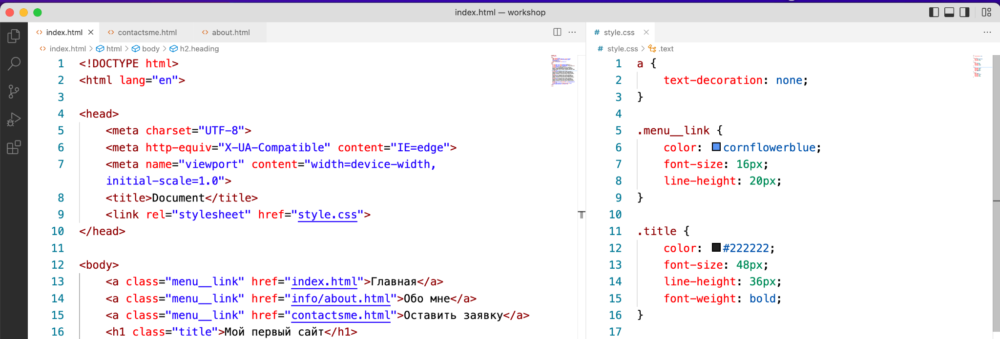

Задание 1
Разминка

Текст задания 
1.	Открыть работу из предыдущего семинара (или скачать по ссылке)
2.	Создать файл стилей style.css
3.	Подключить ко всем страницам
4.	Задать стиль
a {
   text-decoration: none;
}
5.	Проверить работу стилей на всех страницах

Задание для всех учеников, время выполнения 10 минут (5 минут) 

Что должно получиться у учеников 
На всех страницах, у всех ссылок нет нижнего подчеркивания

Преподавателю: Подсказать ученикам, у которых не получилось тайминг 10 минут
Задание 2
Добавляем стили для нашего проекта

Текст задания 
1.	Разделить экран на 2 части, сделать так чтобы файл стилей располагался справа, а все html файлы были слева
2.	Для всех ссылок меню задать класс (придумать логичное название класса)
3.	Для класса меню задать стили
a.	    color: cornflowerblue;
b.	    font-size: 16px;
c.	    line-height: 20px;
4.	Проверить отображения стилей на всех страницах проекта
5.	Для всех заголовков h1 на сайте задать класс и к нему стиль
a.	    color: #222222;
b.	    font-size: 28px;
c.	    line-height: 36px;
d.	    font-weight: bold;

Задание для учеников, время выполнения 20 минут 

Что должно получиться у учеников 

Проверить работы учеников, подсказать на что стоит обратить внимание, тайминг 15 минут

Задание 3
Добавляем стили для нашего проекта

Текст задания 
1.	Для всех параграфов в проекте задать класс
2.	К данному классу задать стили
a.	    font-style: normal;
b.	    font-weight: 300;
c.	    font-size: 18px;
d.	    line-height: 30px;
e.	    color: #7D7987
3.	На главной странице заголовку h2 задать класс
4.	К данному классу указать стиль 
a.	    color: coral;
b.	    font-style: normal;
c.	    font-weight: 700;
d.	    font-size: 36px;
e.	    line-height: 80px;
5.	На странице обо мне
6.	Создать класс для изображения 
7.	Указать стиль для изображения 
a.	border-radius: 10px;
b.	Атрибутом задать значение ширины для картинки

Задание для учеников, время выполнения 20 минут 

Проверить работы учеников, подсказать на что стоит обратить внимание, тайминг 15 минут

Задание 4
Добавляем стили для “Оставить заявку”

Текст задания 
1.	На странице “Оставить заявку” всем полям ввода задать класс
2.	Для полей ввода задать стиль
a.	    width: 200px;
b.	    height: 30px;
c.	    outline: none;
d.	    border: 1px solid #ccc;
e.	    border-radius: 15px;
f.	    font-size: 14px;
g.	    line-height: 30px;
3.	Всем кнопкам задать класс
4.	Всем кнопкам указать стиль
a.	    width: 100px;
b.	    height: 30px;
c.	    font-size: 14px;
d.	    border: 1px solid #ccc;
e.	    border-radius: 10px;
5.	Для всех страниц указать стиль для тега body
a.	font-family: sans-serif;
Задание для учеников, время выполнения 15 минут 

## Задание 5.

Создайте несколько блоков div с текстом внутри. Каждому блоку задайте разные значения отступов margin и padding.

## Задание 6.

Создайте список из пунктов. Или используйте текущее меню страниц. Добавьте эффекты при наведении (:hover), активации (:active)

## Задание 7.

Создайте несколько вложенных элементов и используйте псевдоклассы для выбора first-child и nth-child.

## Задание 8.

Подключите внешний шрифт в текущий проект.

## Задание 9.

Создайте несколько переменных и расставьте их в нужных стилях

## Задание 10.

Подключите Bootstrap на всех страницах (только стили), через эту ссылку -

https://cdn.jsdelivr.net/npm/bootstrap@5.3.2/dist/css/bootstrap.min.css

Добавьте bootstrap стили или добавьте один любой блок с сайта бутстрап - https://getbootstrap.com/docs/5.3/getting-started/introduction/, из любого примера(карточки, таблицы и тд., что угодно) в любую страницу html своего текущего проекта. Можете как на одну страницу, можете - на все, по вашему выбору. Учитывая, что задание последнее - быстрее будет добавить на одну страницу.
