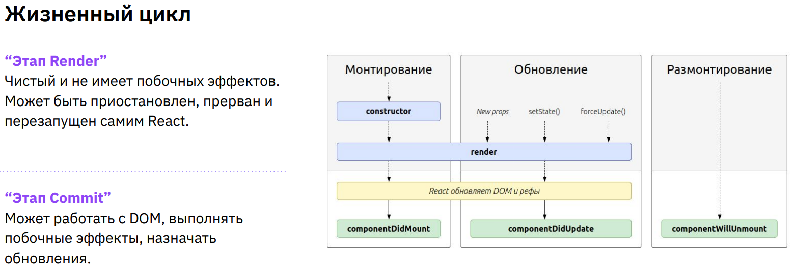

> `state` (Состояние) - Veriable (Переменная) That Stores (Сохраняющая) The Value Assigned (Присвоенное) To It Inside The Component

Hooks:
- useState
- useEffect
- useCallback
- useRef
- useMemo

```js
import React, { useState } from 'react';

export function Counter() {
    const [count, setCount] = useState(0);

    const updateCount = () => {
        setCount(count + 1);
    }

    return (
        <div>
        <span className="counter">{count}</span>
        <button className="counter-button" onClick={updateCount}>+1</button>
    )
}
```
`const [count, setCount] = useState(0);`  
Hook `useState` - Creates A State Variable `count` Which Is Initialized With The Value `0`. 
`setCount` Is A Function = Update The Value Of `count`

```js
import { useState } from "react";

export function MessageList() {
  const [message, setMessage] = useState([
    { id: "id1", text: "message 1", heading: "Heading 1" },
    { id: "id2", text: "message 2", heading: "Heading 2" },
    { id: "id3", text: "message 3", heading: "Heading 3" },
  ]);

  return message.map((message) => (
    <div>
      <h2>{message.heading}</h2>
      <div key={message.id}>{message.text}</div>
    </div>
  ));
}

export default MessageList;

```

`return message.map((message) => (`  
`map` Returns An Array Of JSX Elements For Each Message.  
`<div key={message.id}>{message.text}</div>`  
In `message` Each Element In The Array Returned By `map` Must Have A Unique Value For `key` In Order For (Для Того Чтобы) React To Track Changes

```js
import { useEffect, useRef } from "react";

const RefExample = () => {
  const inputRef = useRef(null);

  const handleClick = () => {
    inputRef.current.focus();
  };

  useEffect(() => {
    inputRef.current?.focus();
  }, []);

  return (
    <div>
      <input type="text" ref={inputRef} />
      <button onClick={handleClick}>Фокус</button>
    </div>
  );
};

export default RefExample;

```


>`useRef` Is Used To Create A Reference (Link) To An Element  

>`useEffect` Allows You To Perform certain actions (Позволяет Выполнить Некоторые Действия) At Certain Points In A Component's Lifecycle  

>`lifecycle` - The Sequence Of Stages (Последовательность Этапов) A Component Goes Through From Its Creation To Its Removal From The DOM  

`inputRef.current.focus()` `inputRef.current?.focus(); }, []);`  
Setting The Focus On The `input`. The Question Mark `?` Is An Optional Processing Statement (Оператор Обработки) That Prevents An Error If `current` is `null`  
An Empty Array `[]` As The Second Argument Indicates That This Effect Should Be Executed Only Once, When The Component Is Mounted  

>`Mounted` (Монтируется) - The Process Of Creating And Adding To The DOM

```js
useEffect(() => {
    const timer = setInterval(() => {
      setTime(new Date());
    }, 1000);
} // To Be Updated Every ...
```